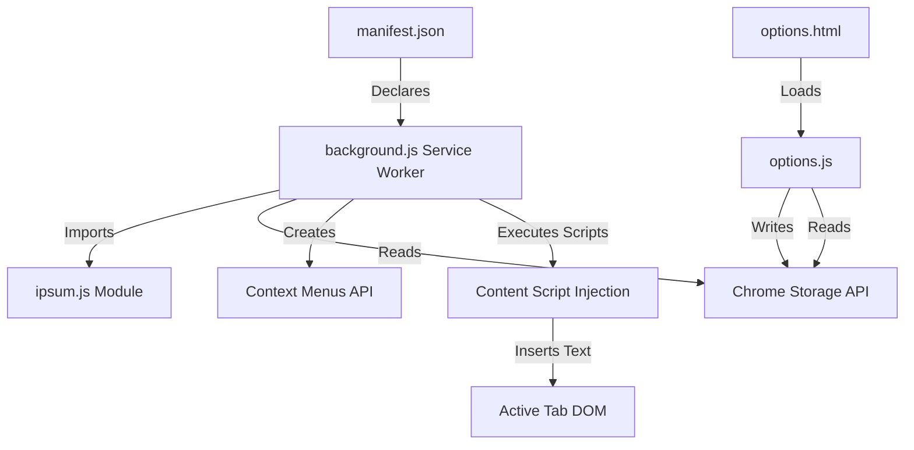
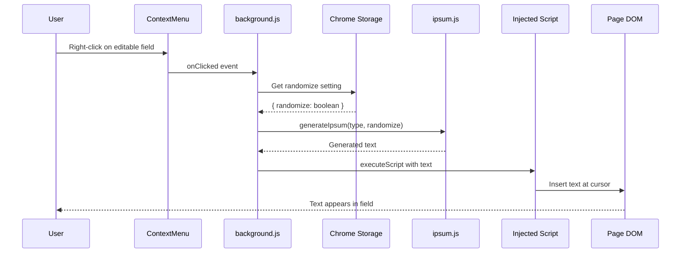
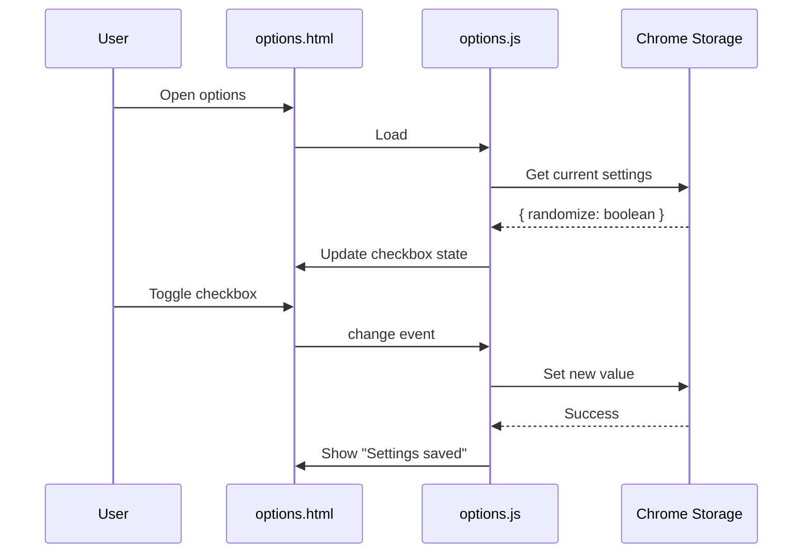

# Architecture

## Component Overview

Right Click Ipsum follows a simple three-layer architecture typical of Chrome Manifest V3 extensions: a persistent service worker (background script), core business logic (text generation), and a user interface layer (options page).

## Data Flow

The extension's data flow is event-driven, triggered by user interactions with the context menu or options page.

### Options Flow

## Design Patterns

| Pattern | Location | Purpose |
|---------|----------|---------|
| Service Worker | `background.js` | Manifest V3 background script that runs in response to events |
| ES Module | `ipsum.js` | Modular text generation logic with pure function export |
| Event Listeners | `background.js`, `options.js` | Declarative event handling for Chrome APIs |
| Script Injection | `background.js:45-63` | Dynamic content script injection for DOM manipulation |
| Functional Core | `generateIpsum()` | Pure function with no side effects, easily testable |
| Storage Abstraction | `chrome.storage.sync` | Browser-managed persistent storage with sync capability |

## Architectural Decisions

### Use of Manifest V3 Service Worker

**Context**: Chrome deprecated Manifest V2 background pages in favor of V3 service workers. Service workers are event-driven and don't maintain persistent state.

**Decision**: Implement background.js as a module-based service worker that registers context menus on installation and responds to click events.

**Consequences**:
- Requires ES module syntax (`type: "module"` in manifest)
- Service worker may be terminated between events, but Chrome manages menu state
- Better performance and security model
- No need for persistent background page
- Must use chrome.storage for persistent data

### Pure Function Text Generation

**Context**: Text generation needs to be predictable, testable, and reusable across different contexts.

**Decision**: Implement `generateIpsum()` as a pure function that takes type and randomization flag as parameters and returns generated text without side effects.

**Consequences**:
- Easy to test in isolation
- No hidden dependencies or state
- Can be imported by different scripts if needed
- Deterministic behavior for same inputs
- Caller (background.js) handles storage and injection

### Script Injection over Content Scripts

**Context**: Chrome extensions can manipulate page content either through declared content scripts or programmatic injection.

**Decision**: Use `chrome.scripting.executeScript()` to inject text insertion logic on-demand rather than running a persistent content script.

**Consequences**:
- Lower memory footprint (no script running on every page)
- Requires `scripting` and `activeTab` permissions
- Script executes in isolated context but has DOM access
- More complex than content scripts but more efficient
- Handles both form fields (INPUT/TEXTAREA) and contentEditable elements

### Chrome Sync Storage

**Context**: User preference (randomize setting) needs to persist across browser sessions and potentially sync across devices.

**Decision**: Use `chrome.storage.sync` API instead of `chrome.storage.local` or localStorage.

**Consequences**:
- Settings automatically sync across user's Chrome instances
- Requires `storage` permission
- 100KB storage limit (sufficient for this extension)
- Async API requires promise handling
- Automatically handles serialization/deserialization

## External Dependencies

| Service | Purpose | Configuration |
|---------|---------|---------------|
| Chrome Extensions API | Core runtime, menus, storage, scripting | Declared in manifest.json permissions |
| Chrome Sync | Settings synchronization | Automatic via chrome.storage.sync |
| No npm packages | Pure JavaScript implementation | None required |

## Component Relationships

### manifest.json
Central configuration file that:
- Declares Manifest V3 compliance
- Specifies required permissions
- Points to background service worker
- Defines options page UI
- Lists extension icons

### background.js (Service Worker)
Event-driven controller that:
- Imports generateIpsum function from ipsum.js
- Creates hierarchical context menu on installation
- Listens for menu clicks
- Fetches randomize setting from storage
- Generates appropriate text
- Injects DOM manipulation script into active tab

### ipsum.js (Core Logic)
Pure business logic module that:
- Stores 8 paragraphs of lorem ipsum source text
- Provides parseSentences() helper to split paragraphs
- Pre-computes flat array of all sentences
- Maps sentence indices to paragraph indices
- Exports generateIpsum() function with type and randomize parameters

### options.html + options.js (Settings UI)
User preferences interface that:
- Renders a single toggle for randomize setting
- Loads current setting from chrome.storage.sync on page load
- Saves updates to storage on checkbox change
- Displays temporary confirmation message
- Styled with options.css for Chrome extension UI consistency

## Security Considerations

- **Content Security Policy**: Manifest V3 enforces strict CSP, preventing inline scripts
- **Isolated Execution**: Service worker and injected scripts run in isolated contexts
- **Limited Permissions**: Only requests necessary permissions (contextMenus, storage, activeTab, scripting)
- **No Remote Code**: All code is bundled, no external script loading
- **User-Initiated Actions**: Text insertion only occurs after explicit user menu selection
- **No Data Exfiltration**: Extension does not communicate with external servers

## Performance Characteristics

- **Initialization**: Context menus created once on extension install/reload (~10ms)
- **Text Generation**: Pure computation, executes in <1ms for all text lengths
- **Storage Access**: Async read from chrome.storage.sync (~5-20ms)
- **Script Injection**: Chrome's executeScript API (~10-50ms depending on page)
- **DOM Manipulation**: Direct element.value assignment or execCommand (~<1ms)
- **Memory Footprint**: Service worker ~500KB, options page ~100KB
- **No Persistent Background**: Service worker terminates when idle (Manifest V3 behavior)
