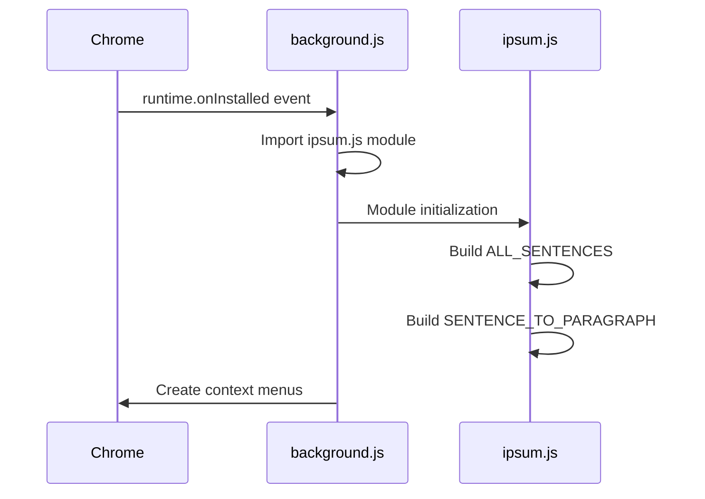
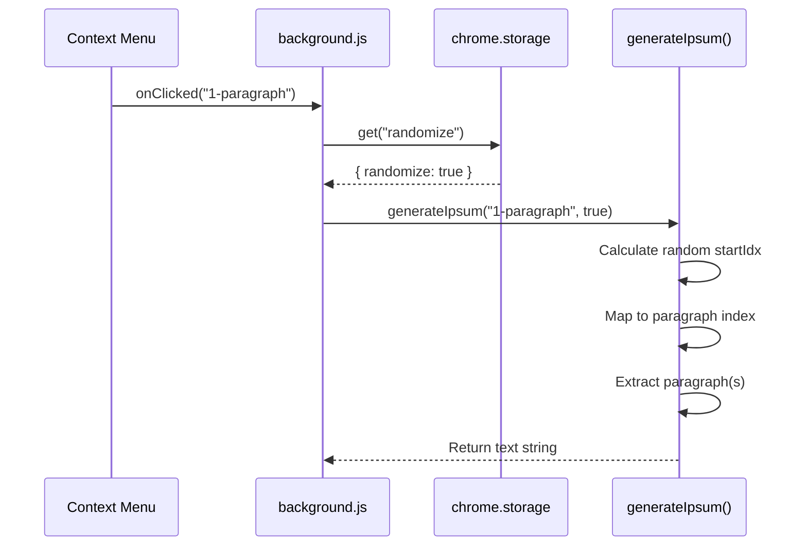

# Private API Index

Internal implementation details not intended for external consumption.

## Summary

This section documents private functions, utilities, and implementation details that support the public API. These are internal to the extension and may change between versions without notice.

## Functions

| Function | Description | Location | Purpose |
|----------|-------------|----------|---------|
| [parseSentences](./functions/parseSentences.md) | Splits paragraph into sentence array | `ipsum.js:13-18` | Module initialization helper |

## Internal Data Structures

### SOURCE_PARAGRAPHS

**Type**: `string[]`
**Location**: `ipsum.js:1-10`
**Purpose**: Array of 8 lorem ipsum paragraphs used as source text

**Structure**:
```javascript
const SOURCE_PARAGRAPHS = [
  "Lorem ipsum dolor sit amet, consectetur adipiscing elit...",
  "Curabitur pretium tincidunt lacus...",
  // ... 6 more paragraphs
];
```

**Characteristics**:
- Total of 8 paragraphs
- Varying lengths (4-6 sentences each)
- Classic lorem ipsum text corpus
- Immutable after module initialization

### ALL_SENTENCES

**Type**: `string[]`
**Location**: `ipsum.js:20`
**Purpose**: Flat array of all sentences from all paragraphs

**Computed via**:
```javascript
const ALL_SENTENCES = SOURCE_PARAGRAPHS.flatMap(parseSentences);
```

**Characteristics**:
- Built during module initialization
- Contains ~40+ sentences total
- Used for sentence-based text generation
- Indexed numerically from 0

### SENTENCE_TO_PARAGRAPH

**Type**: `number[]`
**Location**: `ipsum.js:23-30`
**Purpose**: Mapping array that tracks which paragraph each sentence belongs to

**Structure**:
```javascript
// Example: [0, 0, 0, 0, 0, 1, 1, 1, 1, 2, 2, 2, ...]
// Sentence index 0-4 belong to paragraph 0
// Sentence index 5-8 belong to paragraph 1
// etc.
```

**Build Algorithm**:
```javascript
const SENTENCE_TO_PARAGRAPH = [];
let sentenceIndex = 0;
for (let pIdx = 0; pIdx < SOURCE_PARAGRAPHS.length; pIdx++) {
  const count = parseSentences(SOURCE_PARAGRAPHS[pIdx]).length;
  for (let i = 0; i < count; i++) {
    SENTENCE_TO_PARAGRAPH[sentenceIndex++] = pIdx;
  }
}
```

**Usage**: When generating paragraphs with randomization, maps random sentence start position to corresponding paragraph index.

## Implementation Patterns

### Module Initialization

All data structures are computed once at module load time:

```javascript
// Step 1: Source data (constant)
const SOURCE_PARAGRAPHS = [...];

// Step 2: Parse into sentences
function parseSentences(paragraph) { ... }

// Step 3: Build flat sentence array
const ALL_SENTENCES = SOURCE_PARAGRAPHS.flatMap(parseSentences);

// Step 4: Build sentence-to-paragraph mapping
const SENTENCE_TO_PARAGRAPH = [...];

// Step 5: Export public API
export function generateIpsum(type, randomize) { ... }
```

**Benefits**:
- One-time computation cost
- Fast runtime lookups
- No repeated parsing
- Predictable memory usage

### Randomization Strategy

When `randomize=true`, a random starting index is selected:

```javascript
const startIdx = randomize
  ? Math.floor(Math.random() * ALL_SENTENCES.length)
  : 0;
```

**For Sentences**:
- Start at random sentence index
- Extract N consecutive sentences
- Wrap around via modulo if needed

**For Paragraphs**:
- Start at random sentence index
- Map to paragraph index via `SENTENCE_TO_PARAGRAPH[startIdx]`
- Extract N consecutive paragraphs from that point
- Wrap around via modulo if needed

This ensures varied text while maintaining natural sentence/paragraph groupings.

## Event Flow (Internal)

### Extension Installation



### Text Generation



## Why These Are Private

### parseSentences

- Only needed during module initialization
- Not useful to external consumers
- Implementation detail that may change
- `ALL_SENTENCES` provides the end result

### Data Structures

- Internal representation of text corpus
- Could be replaced with different source text
- Specific array structures are implementation details
- Public API abstracts these away

### Mapping Arrays

- Optimization for paragraph lookup
- Could use different algorithm in future
- External code should use `generateIpsum()` instead

## Maintenance Notes

### Adding New Source Text

To extend or replace the lorem ipsum corpus:

1. Update `SOURCE_PARAGRAPHS` array with new text
2. No other code changes needed (arrays rebuild automatically)
3. Ensure text has proper sentence structure (periods + spaces)

### Performance Considerations

- **Module Load Time**: ~1-2ms for initialization
- **Memory Usage**: ~20KB for all data structures
- **Generation Time**: O(1) for lookup, O(n) for string concatenation
- **No Runtime Parsing**: All parsing happens at module load

## Related Documentation

- [generateIpsum](../public/functions/generateIpsum.md) - Public API that uses these internals
- [Architecture](../architecture.md) - System design overview
