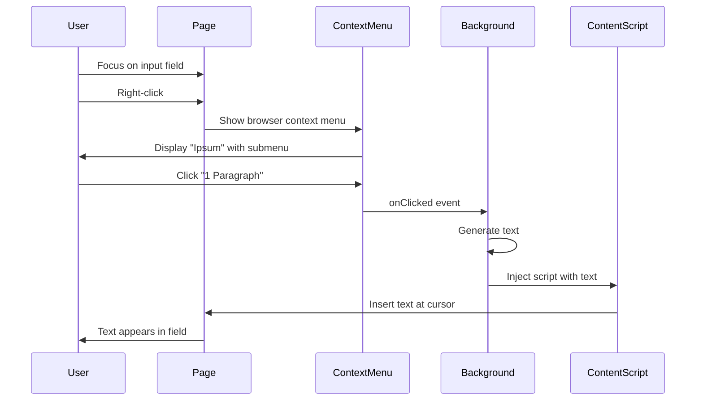

# Context Menu Integration

> Right-click menu system that provides hierarchical access to lorem ipsum text generation options.

## Overview

The context menu feature is the primary user interface for the extension. It registers a hierarchical menu structure that appears when users right-click on editable elements (text inputs, textareas, and contentEditable elements). The menu provides four pre-defined text length options organized under a parent "Ipsum" menu item.

This feature is implemented entirely in `background.js` using Chrome's `contextMenus` API, which is part of the Manifest V3 service worker architecture. The menus are created once during extension installation and persist across browser sessions. Chrome manages the menu state and triggers the service worker when menu items are clicked.

The integration follows a clean separation of concerns: the context menu handles user interaction and event routing, while text generation logic is delegated to the `ipsum.js` module, and DOM manipulation is performed via injected content scripts.

## Configuration

### Menu Structure

The extension creates a hierarchical menu with one parent and four children:

| Menu ID | Parent | Title | Context |
|---------|--------|-------|---------|
| `ipsum-parent` | - | "Ipsum" | editable |
| `1-sentence` | `ipsum-parent` | "1 Sentence" | editable |
| `2-sentences` | `ipsum-parent` | "2 Sentences" | editable |
| `1-paragraph` | `ipsum-parent` | "1 Paragraph" | editable |
| `2-paragraphs` | `ipsum-parent` | "2 Paragraphs" | editable |

### Context Type

All menu items use `contexts: ["editable"]`, which means they only appear when right-clicking on:
- `<input type="text">` and similar form inputs
- `<textarea>` elements
- Elements with `contenteditable="true"` attribute

## Implementation

### Menu Creation

Menus are created during the `chrome.runtime.onInstalled` event, which fires when:
- Extension is first installed
- Extension is updated to a new version
- Chrome browser is updated
- Extension is reloaded in developer mode

```javascript
chrome.runtime.onInstalled.addListener(() => {
  chrome.contextMenus.create({
    id: "ipsum-parent",
    title: "Ipsum",
    contexts: ["editable"],
  });

  chrome.contextMenus.create({
    id: "1-sentence",
    parentId: "ipsum-parent",
    title: "1 Sentence",
    contexts: ["editable"],
  });

  // ... additional menu items
});
```

### Menu Click Handling

The `chrome.contextMenus.onClicked` listener is registered at module scope and activates the service worker when a menu item is clicked:

```javascript
chrome.contextMenus.onClicked.addListener(async (info, tab) => {
  // Guard clause: only handle our menu items
  if (info.parentMenuItemId !== "ipsum-parent") return;

  // Fetch user preferences
  const { randomize = false } = await chrome.storage.sync.get("randomize");

  // Generate text using clicked menu ID as type parameter
  const text = generateIpsum(info.menuItemId, randomize);

  // Inject script to insert text into page
  chrome.scripting.executeScript({
    target: { tabId: tab.id },
    func: (ipsumText) => {
      // DOM manipulation logic runs in page context
      const el = document.activeElement;
      if (!el) return;

      if (el.tagName === "INPUT" || el.tagName === "TEXTAREA") {
        // Form field handling
        const start = el.selectionStart;
        const end = el.selectionEnd;
        el.value = el.value.substring(0, start) + ipsumText + el.value.substring(end);
        el.selectionStart = el.selectionEnd = start + ipsumText.length;
        el.dispatchEvent(new Event("input", { bubbles: true }));
      } else if (el.isContentEditable) {
        // ContentEditable handling
        document.execCommand("insertText", false, ipsumText);
      }
    },
    args: [text],
  });
});
```

## User Experience Flow



## DOM Manipulation Strategies

The injected content script uses two different strategies depending on the element type:

### Form Fields (INPUT/TEXTAREA)

**Method**: Direct `value` property manipulation

**Advantages**:
- Precise control over insertion point
- Preserves existing content before and after cursor
- Updates selection range to end of inserted text

**Implementation**:
```javascript
const start = el.selectionStart;
const end = el.selectionEnd;
el.value = el.value.substring(0, start) + ipsumText + el.value.substring(end);
el.selectionStart = el.selectionEnd = start + ipsumText.length;
el.dispatchEvent(new Event("input", { bubbles: true }));
```

**Key Details**:
- Respects cursor position and text selection
- Replaces selected text if any
- Dispatches `input` event to trigger framework reactivity (React, Vue, etc.)
- Moves cursor to end of inserted text

### ContentEditable Elements

**Method**: `document.execCommand('insertText')`

**Advantages**:
- Browser handles insertion at cursor/selection
- Automatically triggers editing events
- Respects existing content and formatting
- Works with browser undo stack

**Implementation**:
```javascript
document.execCommand("insertText", false, ipsumText);
```

**Key Details**:
- Deprecated API but still widely supported
- Simpler than using Selection and Range APIs
- Automatically handles selection replacement
- Triggers appropriate mutation events

## Permissions Required

| Permission | Purpose |
|------------|---------|
| `contextMenus` | Create and manage right-click menu items |
| `activeTab` | Access the tab where menu was triggered |
| `scripting` | Inject content script to manipulate DOM |

## Limitations

- Menu only appears on editable elements (by design)
- Requires active tab permission (granted on user click)
- Script injection blocked on Chrome Web Store pages and chrome:// URLs
- ContentEditable insertion uses deprecated execCommand (but widely supported)

## Edge Cases

| Scenario | Behavior |
|----------|----------|
| No active element on page | Script returns early, no text inserted |
| Non-editable element focused | Script returns early, no text inserted |
| Text is selected | Selected text is replaced with lorem ipsum |
| Cursor at beginning/end | Text inserted at cursor position |
| Page has input listeners | `input` event is dispatched for React/Vue compatibility |
| Extension context (popup, options) | Menu doesn't appear (no activeTab) |
| Protected pages (Chrome Web Store) | Script injection fails silently |

## Related

- [generateIpsum](../functions/generateIpsum.md) - Text generation function called by menu handler
- [Storage Integration](./storage.md) - How randomize preference is retrieved
- [Script Injection](./script-injection.md) - Details on content script injection strategy
