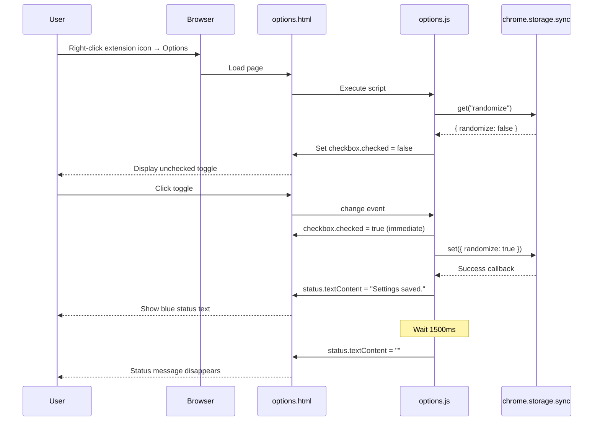

# Options Page UI

> User interface for configuring extension preferences with Chrome-styled toggle controls.

## Overview

The options page provides a simple, accessible interface for users to configure the extension's behavior. It follows Chrome's extension options UI guidelines with a clean, minimal design featuring a single toggle control for the randomization setting. The page is designed to match Chrome's native settings appearance with system fonts, appropriate spacing, and familiar toggle switch styling.

The options UI is declared in `manifest.json` and consists of three files:
- `options.html`: Semantic HTML structure
- `options.js`: Interaction logic and storage integration
- `options.css`: Chrome-styled visual design

## Configuration

### Manifest Declaration

The options page is declared in `manifest.json`:

```json
{
  "options_ui": {
    "page": "options.html",
    "open_in_tab": false
  }
}
```

**Settings**:
- `page`: Path to HTML file
- `open_in_tab`: `false` = opens in embedded popup (more common for simple options)

### Access Methods

Users can access options via:
1. Right-click extension icon → "Options"
2. Chrome extensions page → Extension card → "Details" → "Extension options"
3. Directly via `chrome://extensions/?options=<extension-id>`

## HTML Structure

### Semantic Markup

```html
<!DOCTYPE html>
<html lang="en">
  <head>
    <meta charset="UTF-8" />
    <link rel="stylesheet" href="options.css" />
  </head>
  <body>
    <h1>Right Click Ipsum</h1>
    <p class="description">
      By default, generated text always starts with "Lorem ipsum..."
    </p>

    <label class="toggle-row">
      <span class="toggle-label">Randomize starting location</span>
      <input type="checkbox" id="randomize" />
      <span class="toggle-switch"></span>
    </label>

    <p class="hint">
      If enabled, a random sentence from the source text is used as the starting
      point instead of always starting with "Lorem ipsum..."
    </p>

    <p class="status" id="status"></p>

    <script src="options.js"></script>
  </body>
</html>
```

**Key Elements**:
- `<h1>`: Extension name (matches manifest name)
- `.description`: Default behavior explanation
- `.toggle-row`: Custom toggle switch (checkbox + styled label)
- `.hint`: Additional context for the setting
- `.status`: Feedback message container (initially empty)

### Accessibility Features

- Semantic HTML5 structure
- Native `<input type="checkbox">` for keyboard accessibility
- `<label>` wrapping ensures click target includes text
- `lang="en"` attribute for screen readers
- Clear, descriptive text

## CSS Styling

### Design System

**Typography**:
- Font stack: `-apple-system, BlinkMacSystemFont, "Segoe UI", Roboto, sans-serif`
- Matches system fonts on macOS, Windows, and Linux
- Font sizes: 16px (h1), 14px (labels), 13px (description), 12px (hints)

**Colors**:
- Primary text: `#202124` (dark gray, Chrome standard)
- Secondary text: `#5f6368` (medium gray)
- Hint text: `#80868b` (light gray)
- Accent color: `#1a73e8` (Chrome blue)
- Toggle track off: `#dadce0` (light gray)

**Layout**:
- Fixed width: 360px (standard for Chrome extension options)
- Padding: 16px top/bottom, 20px left/right
- Spacing: Consistent margins for visual hierarchy

### Custom Toggle Switch

The checkbox is visually hidden and replaced with a custom styled toggle:

```css
/* Hide native checkbox */
.toggle-row input[type="checkbox"] {
  position: absolute;
  opacity: 0;
  pointer-events: none;
}

/* Toggle switch track */
.toggle-switch {
  position: relative;
  width: 36px;
  height: 20px;
  background: #dadce0;
  border-radius: 10px;
  transition: background 0.2s;
}

/* Toggle switch knob */
.toggle-switch::after {
  content: "";
  position: absolute;
  top: 2px;
  left: 2px;
  width: 16px;
  height: 16px;
  background: #fff;
  border-radius: 50%;
  transition: transform 0.2s;
  box-shadow: 0 1px 3px rgba(0, 0, 0, 0.2);
}

/* Checked state */
.toggle-row input[type="checkbox"]:checked + .toggle-switch {
  background: #1a73e8;
}

.toggle-row input[type="checkbox"]:checked + .toggle-switch::after {
  transform: translateX(16px);
}
```

**Visual Behavior**:
- Off state: Gray track, knob on left
- On state: Blue track, knob slides right
- Smooth transitions (200ms)
- Subtle shadow on knob for depth

## JavaScript Logic

### Initialization

Page loads current setting from storage and updates UI:

```javascript
const checkbox = document.getElementById("randomize");
const status = document.getElementById("status");

// Load current setting
chrome.storage.sync.get("randomize", ({ randomize }) => {
  checkbox.checked = randomize || false;
});
```

### User Interaction

Checkbox changes trigger storage update with visual feedback:

```javascript
checkbox.addEventListener("change", () => {
  chrome.storage.sync.set({ randomize: checkbox.checked }, () => {
    // Show confirmation
    status.textContent = "Settings saved.";

    // Clear after 1.5 seconds
    setTimeout(() => {
      status.textContent = "";
    }, 1500);
  });
});
```

## User Experience Flow



## Visual States

### Default State (First Load)

- Toggle: Off (gray track, knob left)
- Status: Empty
- Description text visible
- Hint text visible

### After Toggle Interaction

- Toggle: On (blue track, knob right)
- Status: "Settings saved." in blue for 1.5s
- Smooth animations on toggle switch

### Responsive Behavior

While fixed at 360px width, the page is responsive to:
- Font size preferences (uses relative units internally)
- Color scheme preferences (could add `prefers-color-scheme` support)
- Keyboard navigation (native checkbox accessibility)

## Best Practices Implemented

1. **Progressive Enhancement**: Works even if JavaScript fails to load (checkbox is functional)
2. **Immediate Feedback**: Checkbox updates instantly, storage happens async
3. **Helpful Context**: Description and hint text explain the setting clearly
4. **Familiar Patterns**: Matches Chrome's native settings appearance
5. **Minimal Cognitive Load**: Single setting, clear purpose
6. **Status Feedback**: Confirmation message provides closure
7. **Auto-clear Status**: Message disappears automatically (no manual dismissal)

## Permissions Required

| Permission | Purpose |
|------------|---------|
| `storage` | Read and write user preferences |

## Limitations

- Single setting only (by design for simplicity)
- Fixed width (360px, standard for Chrome options)
- Embedded mode only (`open_in_tab: false`)
- No setting validation (boolean toggle can't have invalid state)

## Edge Cases

| Scenario | Behavior |
|----------|----------|
| Page loaded while offline | Loads last cached value, saves work when online |
| Rapid toggle clicks | Each change saves, last write wins |
| JavaScript disabled | Checkbox works but doesn't persist to storage |
| Storage quota exceeded | Chrome handles error (unlikely with 1 boolean) |
| Multiple tabs open | All tabs see updated value via storage event |

## Future Extensibility

The page structure supports easy addition of more settings:

```html
<!-- Hypothetical additional settings -->
<label class="toggle-row">
  <span class="toggle-label">Enable keyboard shortcuts</span>
  <input type="checkbox" id="shortcuts" />
  <span class="toggle-switch"></span>
</label>

<label class="select-row">
  <span class="select-label">Default text length</span>
  <select id="defaultLength">
    <option value="1-sentence">1 Sentence</option>
    <option value="1-paragraph">1 Paragraph</option>
  </select>
</label>
```

## Related

- [Storage Integration](./storage.md) - How settings are persisted
- [Context Menu Integration](./context-menu.md) - How settings affect text generation
- [Chrome Options UI Guidelines](https://developer.chrome.com/docs/extensions/mv3/options/) - Official documentation
