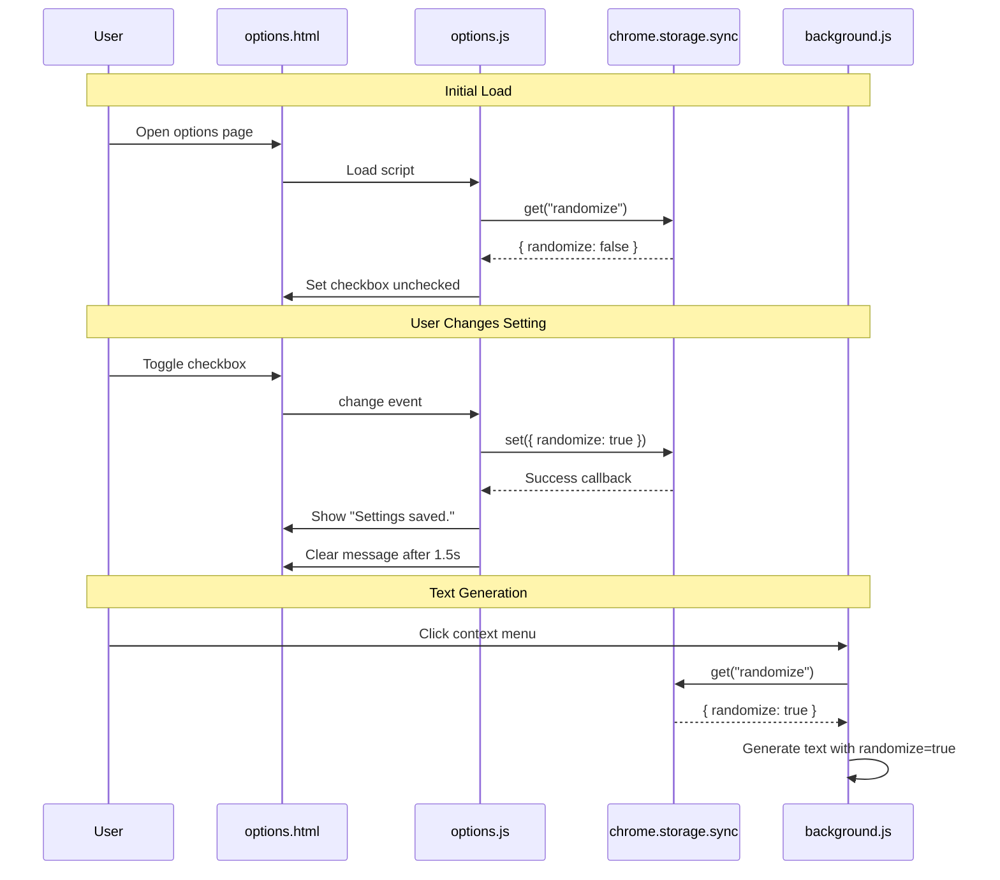

# Storage Integration

> Chrome sync storage system for persisting user preferences across browser instances.

## Overview

The storage feature manages user preferences using Chrome's `chrome.storage.sync` API, which automatically synchronizes settings across all devices where the user is signed into Chrome. Currently, the extension stores a single preference: whether to randomize the starting position of generated lorem ipsum text.

This feature demonstrates best practices for Manifest V3 storage:
- Async API usage with promise/callback pattern
- Default value handling for new installations
- User feedback on settings changes
- Automatic cross-device synchronization

The storage API is accessed from two locations:
1. **background.js**: Reads the `randomize` setting before generating text
2. **options.js**: Reads and writes the setting from the options UI

## Configuration

### Storage Schema

| Key | Type | Default | Description |
|-----|------|---------|-------------|
| `randomize` | `boolean` | `false` | When true, text generation starts from random position in corpus |

### Storage Type: Sync vs Local

The extension uses `chrome.storage.sync` instead of `chrome.storage.local`:

**Advantages of Sync Storage**:
- Settings automatically sync across user's Chrome instances
- 100KB storage limit (more than sufficient for preferences)
- Built-in serialization/deserialization
- No additional backend infrastructure needed

**Limitations**:
- Requires user to be signed into Chrome
- Network-dependent synchronization
- Rate limits: MAX_WRITE_OPERATIONS_PER_HOUR = 1,800
- Not suitable for large data (like cached text)

## Implementation

### Reading Settings (background.js)

The background service worker reads the setting before each text generation:

```javascript
chrome.contextMenus.onClicked.addListener(async (info, tab) => {
  if (info.parentMenuItemId !== "ipsum-parent") return;

  // Read with default value
  const { randomize = false } = await chrome.storage.sync.get("randomize");

  const text = generateIpsum(info.menuItemId, randomize);

  // ... script injection
});
```

**Key Patterns**:
- Uses async/await for cleaner code
- Destructures result with default value (`= false`)
- Reads on every menu click (fresh data, minimal performance impact)
- Single key read is fast (~5-20ms)

### Reading Settings (options.js)

The options page loads the current setting when opened:

```javascript
chrome.storage.sync.get("randomize", ({ randomize }) => {
  checkbox.checked = randomize || false;
});
```

**Key Patterns**:
- Uses callback pattern (alternative to promises)
- Handles undefined case with `|| false`
- Sets checkbox state based on stored value
- Runs once on page load

### Writing Settings (options.js)

Settings are saved when the user toggles the checkbox:

```javascript
checkbox.addEventListener("change", () => {
  chrome.storage.sync.set({ randomize: checkbox.checked }, () => {
    status.textContent = "Settings saved.";
    setTimeout(() => {
      status.textContent = "";
    }, 1500);
  });
});
```

**Key Patterns**:
- Writes immediately on change (auto-save)
- Provides user feedback via status message
- Temporary status message (1.5 seconds)
- No explicit error handling (Chrome handles failures internally)

## Data Flow



## Storage API Details

### chrome.storage.sync.get()

**Signature**: `chrome.storage.sync.get(keys, callback)`

**Parameters**:
- `keys`: String or array of strings (keys to retrieve)
- `callback`: Function called with result object

**Async Alternative**: Returns a Promise when callback is omitted

```javascript
// Callback style
chrome.storage.sync.get("randomize", (result) => {
  console.log(result.randomize);
});

// Promise style
const { randomize } = await chrome.storage.sync.get("randomize");
```

### chrome.storage.sync.set()

**Signature**: `chrome.storage.sync.set(items, callback)`

**Parameters**:
- `items`: Object with key-value pairs to store
- `callback`: Optional function called on completion

**Async Alternative**: Returns a Promise when callback is omitted

```javascript
// Callback style
chrome.storage.sync.set({ randomize: true }, () => {
  console.log("Saved");
});

// Promise style
await chrome.storage.sync.set({ randomize: true });
```

## User Experience

### Options Page UI

The options page provides a simple, Chrome-styled toggle interface:

**Visual Elements**:
- Page title: "Right Click Ipsum"
- Description text explaining default behavior
- Toggle switch with label: "Randomize starting location"
- Hint text explaining the setting
- Status message area (shows feedback)

**Styling**:
- Uses system fonts (`-apple-system`, `BlinkMacSystemFont`, etc.)
- Chrome blue accent color (`#1a73e8`)
- Custom toggle switch styled to match Chrome settings
- Responsive width (360px)

### Settings Feedback

When user toggles the setting:
1. Checkbox changes immediately (instant visual feedback)
2. Setting saves to storage (async)
3. Status message appears: "Settings saved." (blue color)
4. Message automatically clears after 1.5 seconds
5. Change syncs to other Chrome instances (background, automatic)

## Safety Considerations

- **Data Persistence**: Settings survive browser restarts and extension reloads
- **Sync Conflicts**: Chrome handles sync conflicts automatically (last-write-wins)
- **Privacy**: Data stored locally and in user's Chrome sync account only
- **No Sensitive Data**: Only stores boolean preference (no PII)
- **Quota Limits**: Well within sync storage limits (1 boolean ~ 5 bytes of ~100KB limit)
- **Error Handling**: Chrome API handles errors internally; failures are rare

## Performance Characteristics

- **Read Latency**: 5-20ms for local cache, 50-200ms if syncing from cloud
- **Write Latency**: <10ms to local cache, background sync to cloud
- **Storage Size**: 1 key-value pair, negligible storage usage
- **Network Usage**: Minimal (single boolean, only syncs on change)
- **Service Worker Impact**: Storage reads don't keep worker alive unnecessarily

## Edge Cases

| Scenario | Behavior |
|----------|----------|
| First install, no setting exists | `get()` returns undefined, default to `false` |
| User not signed into Chrome | Storage works locally but doesn't sync |
| Network offline | Storage works locally, syncs when online |
| Multiple tabs change setting | Last write wins, all tabs see latest value |
| Storage quota exceeded | Unlikely with 1 boolean, Chrome would throw error |
| Corrupt storage data | Chrome API handles internally, returns undefined |

## Future Extensibility

The storage system can easily accommodate additional preferences:

```javascript
// Hypothetical additional settings
const defaultSettings = {
  randomize: false,
  defaultLength: "1-paragraph",
  customSource: false,
  languageVariant: "en"
};

const settings = await chrome.storage.sync.get(defaultSettings);
```

## Related

- [Context Menu Integration](./context-menu.md) - How storage is used during text generation
- [Options Page UI](./options-ui.md) - User interface for changing settings
- [Chrome Storage API](https://developer.chrome.com/docs/extensions/reference/storage/) - Official documentation
